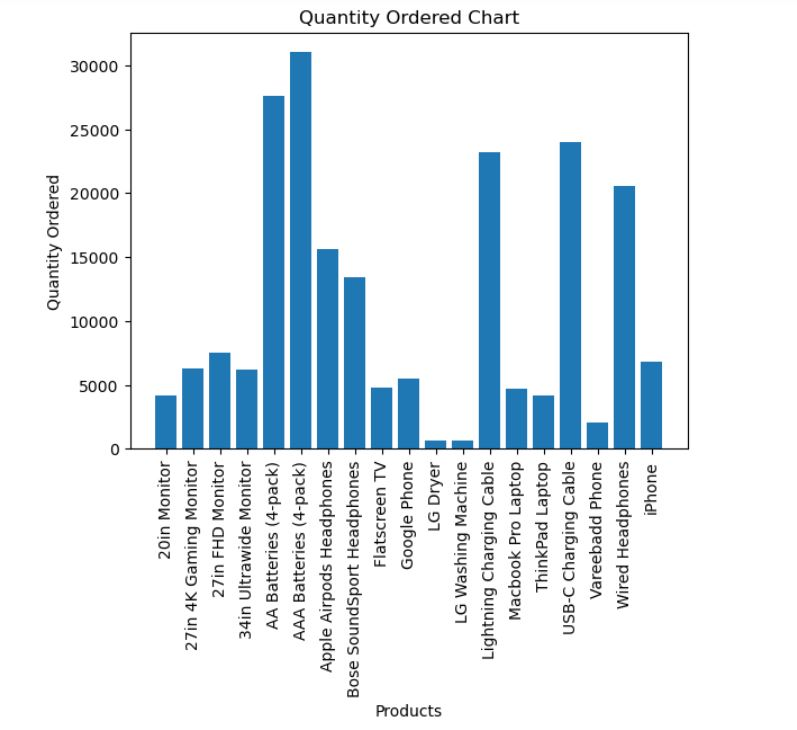
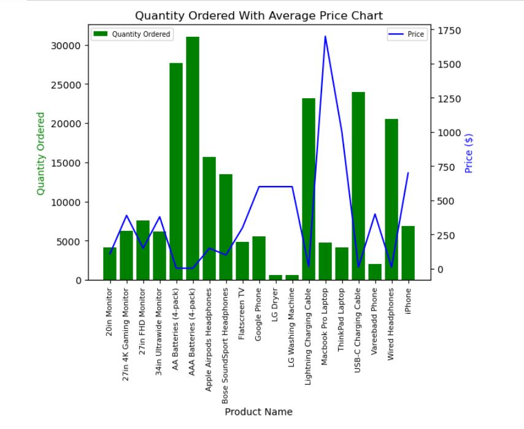

# Miracle_Chukwu_Data_Analytics_Portfolio

## [Project 1: Electronic Store Sales Analysis](https://github.com/miraclechukwu/Electronic-Store-Sales-Analysis)

-	Utilized **_Python_** to analyze 186850 entries and 6 column of sales data in order to gain insights into sales performance, customer behavior, and product popularity. 
-	Implemented **_Data Cleaning_** and **_Transformation_** techniques to comb through the data and identified the key requirements 
-	Aggregated and visualized the data by using **_pandas_** and **_matplotlib_** to compile a professional report

#### _Overview of Quantity Ordered and the effect of Average Price_:

Quantity Ordered                |  Quantity Ordered with Average Price
:------------------------------:|:--------------------:
 |  

---

# [Project 2: Pizza Sales Analysis](https://github.com/miraclechukwu/PIZZA-SALES-ANALYSIS/tree/main)
- Used **SQL** for in-depth analysis of Pizza Sales dataset containing 48,620 rows and 12 columns.
- Employed SQL data cleaning techniques to handle missing values, remove duplicates, and ensure data consistency.
- Utilized SQL transformation queries to aggregate, filter, and join data, generating meaningful insights and actionable reports.
- Employed **CASE** statements to categorize and group data based on specific conditions.
- Utilized **Subqueries** for in-depth analysis and to extract subsets of data.

#### _Overview of percentage sales by pizza category_:

